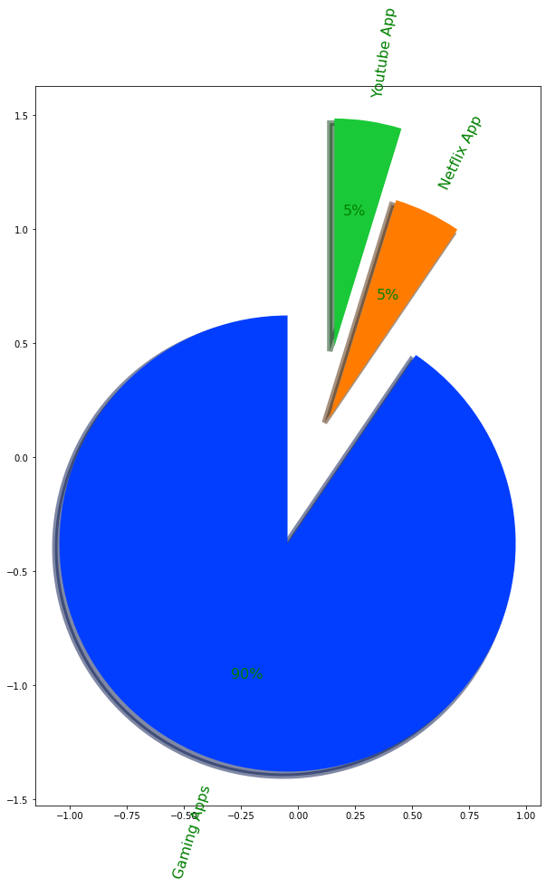
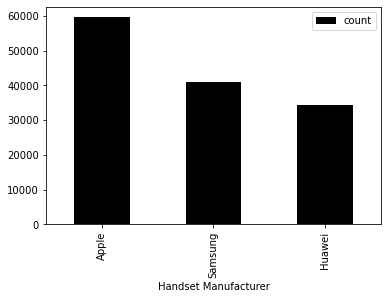
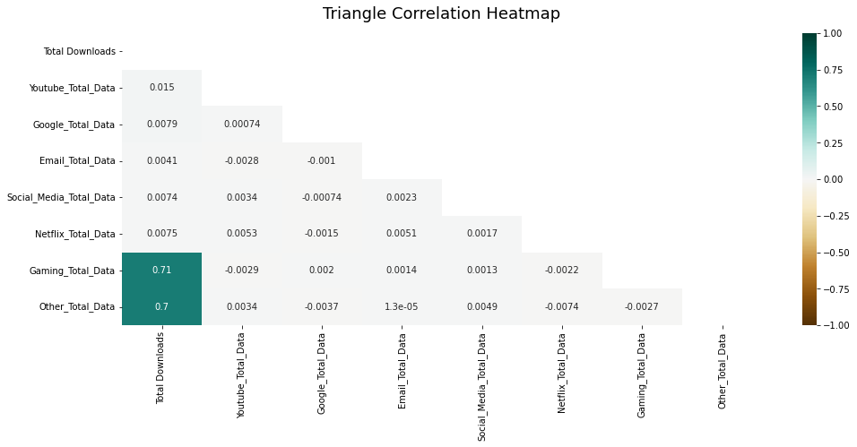
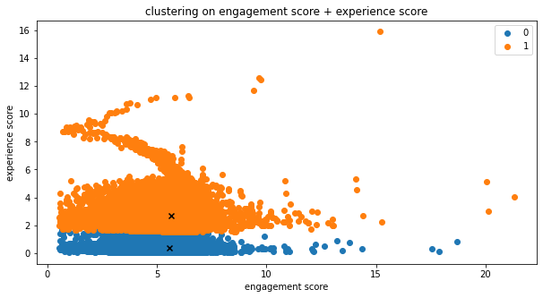

# telecom-user-analytics


This project will answer the questions:

* Is the telecommunications firm worth investing in/ or buying?
* Is there potential for the company to expand?

# Screenshots







# Setup
## Docker

You can quickly install it using docker:

```bash
docker pull abelblue/telecom_image:1.0
docker run abelblue/telecom_image:1.0
```

## Installation for linux

```bash
git clone https://github.com/Abel-Blue/telecom-user-analytics.git
cd telecom-user-analytics
sudo python3 setup.py install
```